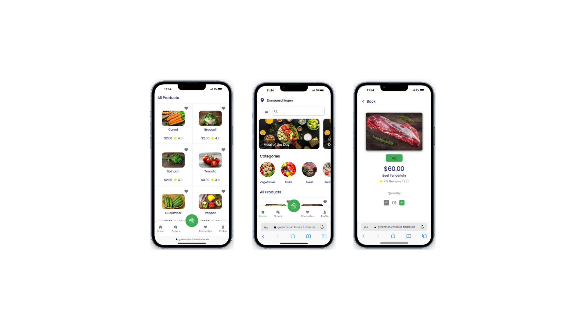

# GreenMarket - Online Shop

The GreenMarket onlineshop was our full-stack final project, after our 6.5 month bootcamp. It is a combination of the topics we learned.

## Description

GreenMarket is a full stack online shop with many different features. Among other things, you can view:

- Login
- Edit user profile
- Logout
- Favorites list
- Add favorites from the list directly to the shopping cart
- Add products to the shopping cart, delete and adjust quantities
- Overview of the logged-in customer's orders, with detailed overview of orders
- Product categories
- Combined filter option and sorting function for price, price range and categories
- Searchbar for products
- Daily and weekly offers
- Meal of the day, with a recipe and the option to add all the products required for the recipe to the shopping cart

We have tried to create a store that is as user-friendly as possible so that users can find and order the products they need as quickly as possible.

## Compatible Screensizes

- Smartphone
- Desktop

## Tech Stack

- React.js
- Vite
- VS Code
- HTML
- CSS
- JavaScript
- Git
- Node.js
- Express.js
- MongoDB
- mongoose
- Trello
- figma

## Demo

**E-Mail: adn.speer@gmail.com** 
**Passwort: Adrian**

https://greenmarket.tobias-tischer.de/

## Screenshots

